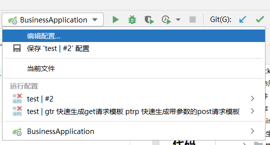
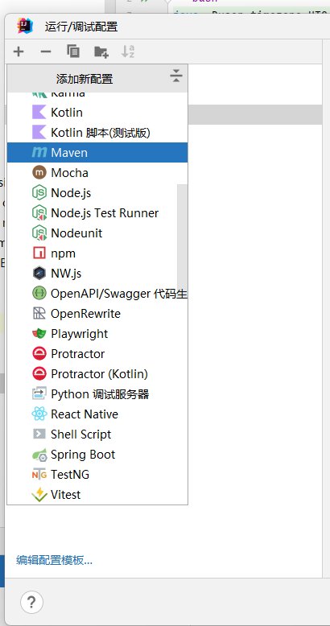
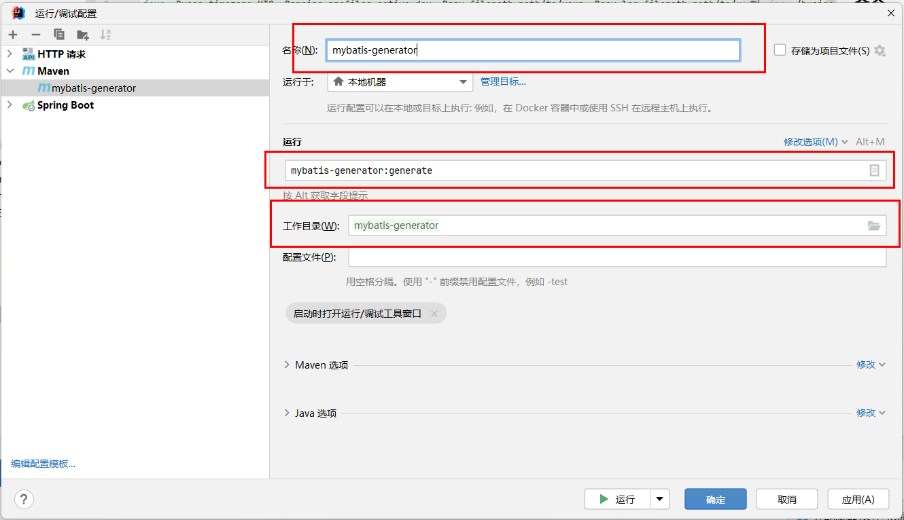
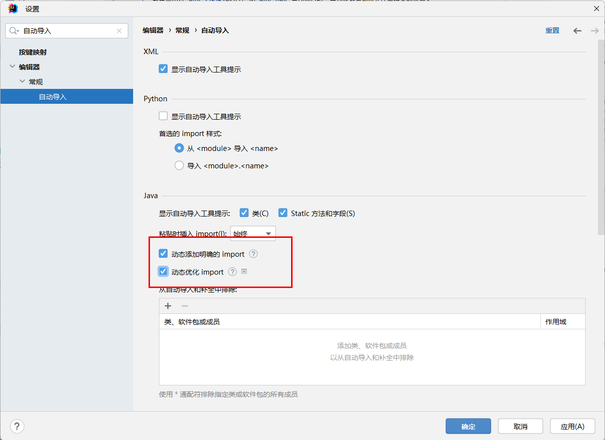
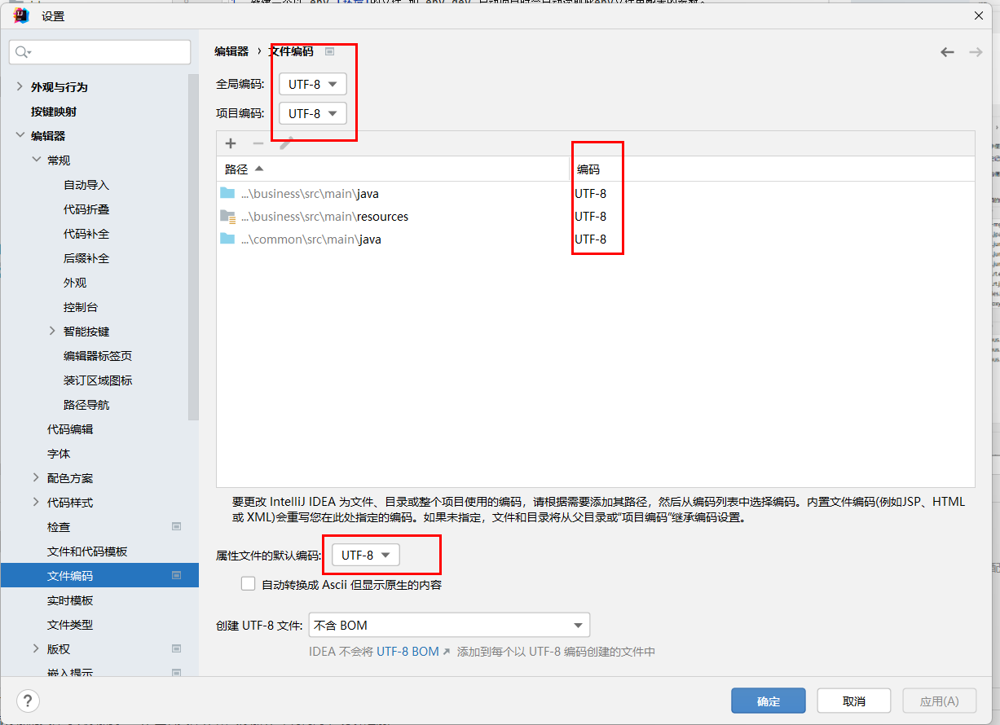
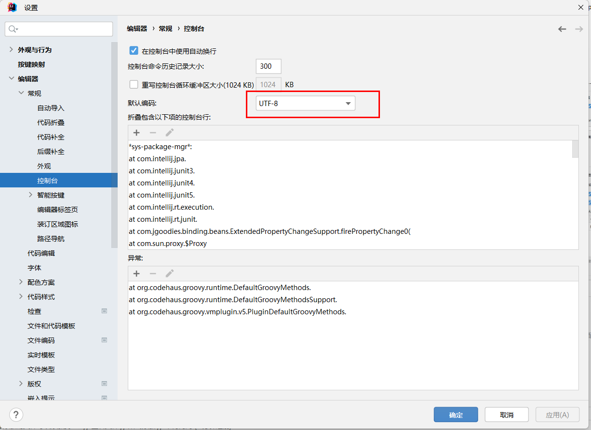
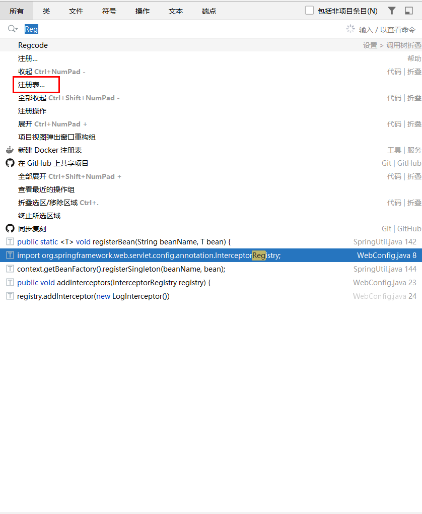
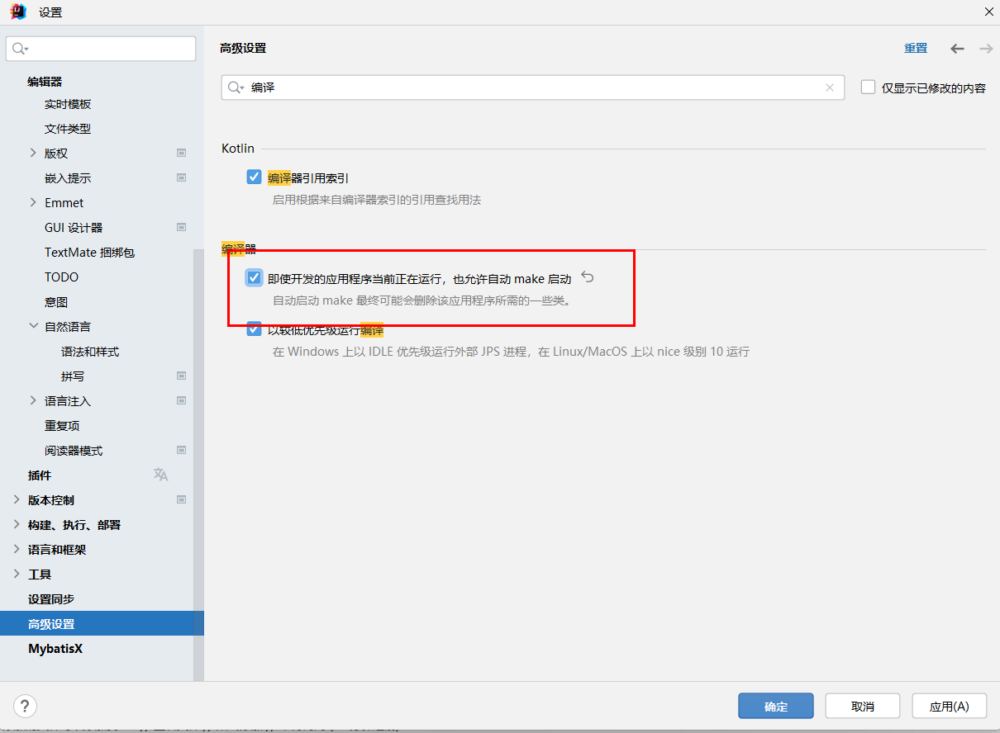
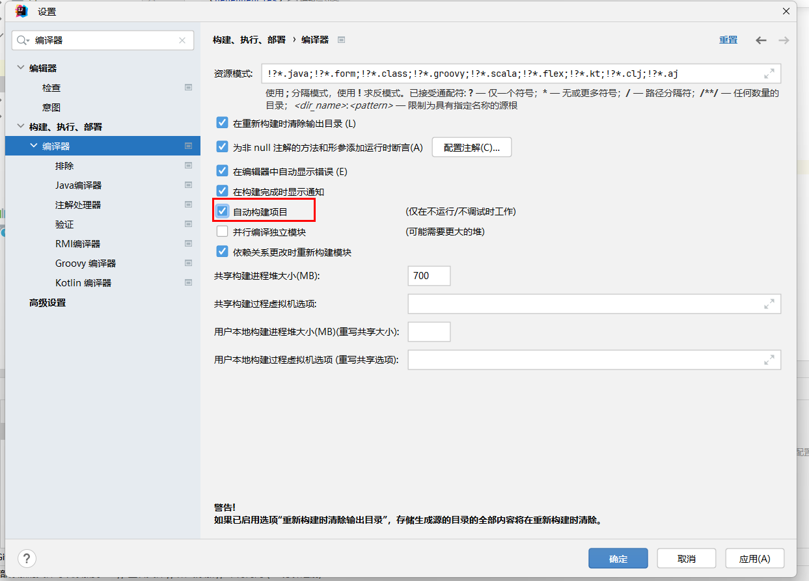

## 启动命令

1. env.filepath 非必须，默认当前项目根目录
2. env.log-filepath 非必须，默认当前项目目录下的logs目录
3. user.timezone 必须（与数据库保持同步）
4. spring.profiles.active 非必须，默认dev

```bash
java -Duser.timezone=UTC -Dspring.profiles.active=dev -Denv.filepath=path/to/your -Denv.log-filepath=path/to/your -jar ./business/target/nls-api.jar
```

## 1.配置

1. 新建一个以.env.[环境]的文件,如.env.dev,启动项目时会自动读取此env文件里配置的参数。
2. 可配置项
  ```htmml
   SERVER_PORT=18000
   SERVER_CONTEXT_PATH=/nls
   APPLICATION_NAME=nls-api
   TIMEZONE=UTC
    
   DB_URL=jdbc:mysql://127.0.0.1:3306/nls_api?serverTimeZone=UTC&allowMultiQueries=true
   DB_DRIVER=com.mysql.cj.jdbc.Driver
   DB_USERNAME=root
   DB_PASSWORD=123456
    
   DATASOURCE_MINIMUM_IDLE=2
   DATASOURCE_MAXIMUM_POOL_SIZE=10
    
   MYBATIS_MAPPER_LOCATIONS=classpath:/mapper/**/*.xml
  ```

## 代码生成器配置



选择mybatis代码生成器所在目录，在命令行中指定插件命令（输入generator可快速检索）



## 多语言支持

在请求时，header中带上accept-language参数就可以进行国际化，支持语言(简体中文 zh-CN，美式英语 en-US，日语 ja-JP)


## IDEA配置

### 自动导入


### 文件编码



### 热部署

加入依赖（依赖要添加到需要热部署的项目中才会生效）
```xml
        <dependency>
            <groupId>org.springframework.boot</groupId>
            <artifactId>spring-boot-devtools</artifactId>
            <scope>runtime</scope>
            <optional>true</optional>
        </dependency>
```

配置IDEA
IDEA 2023版本前需要配置注册表总的Auto make

IDEA 2023版本后只需要配置如下几项


